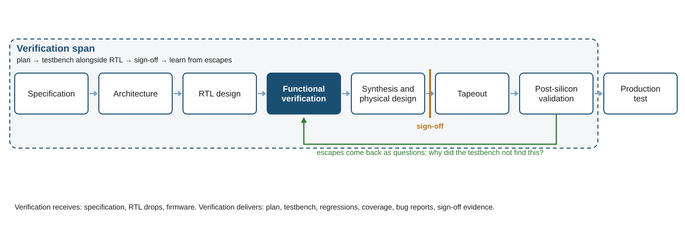

# What Is Design Verification? {#sec-ch01}

> A passing test is a statement about the test, not about the design.

::: {.callout-note title="Learning objectives"}
After this chapter you will be able to:

1. Define verification, validation and test, and tell them apart in a sentence each.
2. Explain why exhaustive verification of a real design is impossible, and what replaces it.
3. Estimate the relative cost of a bug from the stage at which it is found.
4. Place verification in the silicon lifecycle and state what "sign-off" means.
5. Recognize the three parts of every testbench, stimulus, checker and coverage, in a hundred-line example.
:::

## The test that passed

In July 2023 Tavis Ormandy, a security researcher at Google, published a bug in a processor core that had been shipping for years. The core was AMD's Zen 2, and the bug became known as Zenbleed. The mechanism was a mistake in how the core recovered from a mispredicted register-clearing instruction. A register that the architecture requires to be zero could instead hold stale data left behind by another process, another virtual machine, or the other thread on the same core [@ormandy2023zenbleed; @amd2023sb7008]. The parts had passed every test their makers ran. They had passed the tests of every customer who qualified them.

What found the bug was not a customer, a crash, or a clever proof. It was a program that generated random instruction sequences, ran them on real silicon, and compared what came out against a second run of the same sequence with serializing fences inserted. When the two disagreed, the program stopped and printed the sequence. That is the whole method. It is the method this book teaches, and the reason it works is worth stating before anything else:

> A passing test is a statement about the test, not about the design.

A test can only fail on behavior it stimulates and checks. Everything it does not stimulate is unknown, and everything it does not check is assumed. The core had been tested for years by tests that never produced the exact sequence, or produced it and did not look. The random program produced it and looked.

Ormandy's own account of how is worth reading, because it is a verification testbench described by someone who does not use the word. He generated random instruction sequences; that is stimulus. He used the processor's performance counters to tell which sequences reached new microarchitectural behavior; that is coverage. He ran each sequence twice, once as written and once with serializing fences inserted, and compared the final architectural state; that is a checker, with the fenced run as the reference model. "I found this bug by fuzzing," he writes, and then asks the question this chapter is about: "vendors fuzz their own products extensively ... So how come this bug wasn't found earlier?" [@ormandy2023zenbleed]

The rest of this chapter is about what that sentence costs when it is forgotten, why it is so easy to forget, and where in the life of a chip the people whose job is to remember it do their work. At the end you will run a directed test that passes, then a random test with a checker that fails, on the same sixty-line design, and see the sentence happen.

## Verification, validation and test {#sec-ch01-definitions}

Three words are used loosely in conversation and precisely in this book. The first two follow the distinction drawn in the IEEE standard for verification and validation, which asks separately whether a product conforms to the requirements of the activity that produced it and whether it satisfies its intended use [@ieee1012-2024]; the third is the semiconductor industry's own.

::: {.callout-note title="Definition"}
**Verification** asks: *does the design do what the specification says, and nothing else?* Its inputs are a specification and a description of the design, usually register-transfer-level (RTL) code. Its output is evidence, in the form of executed tests, coverage data and proofs, that the two agree.

**Validation** asks: *is the specification the right one?* Its inputs are the specification and the world the product must work in: customers, standards, software, other chips. Its output is confidence that building exactly what the specification says will produce something useful.

**Test** asks: *did this particular die come out of the fab correctly?* Its inputs are a manufactured part and a set of patterns that exercise its structure. Its output is a pass or fail for that die. Test is about manufacturing defects, not design errors; a design bug is present in every die and no amount of test will find it.
:::

The three answer different questions and are done by different people with different tools, but they leak into one another. A verification engineer who reads the specification closely will find places where it is ambiguous or wrong, and will end up doing a little validation. A validation engineer running software on first silicon will find design bugs that verification missed, and will end up doing a little verification. The words matter because the *evidence* each produces is different, and a project needs to know which kind of evidence it has.

Verification itself has several flavors, distinguished by what they compare and how.

- **Functional verification** compares the behavior of the RTL against the specification, by simulating it with a testbench. It is the subject of most of this book and the largest activity by headcount on almost every chip.
- **Formal verification** compares the RTL against properties written in a formal language, by proof rather than by simulation. It can show that something *never* happens, which simulation cannot. Part IV covers it.
- **Equivalence checking** compares two descriptions of the same design, typically the RTL and the gate-level netlist that synthesis produced from it, to show they compute the same function. It is formal, mechanical and usually owned by the implementation team.
- **Physical verification** compares the layout against manufacturing rules and against the netlist. It has nothing to do with function and everything to do with whether the fab can build the chip.
- **Post-silicon validation** runs the manufactured chip in a real system, with real software, at real speed. It finds the bugs that everything above missed, and it is the activity that Ormandy, from outside AMD, was in effect performing.

When someone says "verification" without qualification, in this book and in most companies, they mean functional verification: the testbench, the simulator and the people who write them.

## Why verification is hard {#sec-ch01-hard}

If verification were a matter of trying every input and checking every output, it would be tedious but not hard. It is hard because none of that is possible, and the ways it is impossible are worth understanding, because each one shaped a tool you will learn.

### The state space

A design with $n$ flip-flops has $2^n$ possible states, and its behavior depends not only on the current input but on the sequence of inputs that led to the current state. A small block might have a few thousand flip-flops. There are more states in it than atoms in the observable universe, and a simulation of any length visits a vanishingly small fraction of them. Simulation does not cover the state space; it *samples* it. Every technique in Part II (constrained-random stimulus, functional coverage, assertions, each defined there) is a way of sampling more cleverly, or of knowing what the sample missed.

Formal tools do not sample. They reason about all states at once, symbolically, which is why they can prove that a state is unreachable. The price is that the reasoning grows with the design, and for large designs it does not finish. Formal and simulation are complements, not competitors, and Part IV is about choosing between them.

### The specification is prose {#sec-ch01-prose}

The specification says "the FIFO holds sixteen entries". The RTL says `count == LAST` (a constant the designer set to fifteen). Between the two sentences lies every assumption the designer made while translating one into the other, and the reader of the RTL cannot see the assumptions, only their consequences. Bugs live in that translation. Most are not coding errors of the kind a compiler or lint tool can catch; they are correct implementations of a slightly wrong understanding. The FIFO at the end of this chapter has exactly such a bug, and no static tool flags it, because every line of it is well formed.

This is why verification cannot be done by reading the RTL. A reader of the RTL shares the designer's assumptions or invents their own. Verification needs a second, independent translation of the specification, one that was not made by the same person with the same assumptions, so that the two can be compared. That independent translation is the *checker*, and building good ones is the heart of the craft.

### Controllability and observability

To find a bug, a test must first drive the design into the state where the bug lives, and then notice the wrong behavior when it happens. The first is *controllability*; the second is *observability*. Both get harder as the design gets bigger. Reaching a particular corner of a memory controller from the pins of a system-on-chip can take millions of cycles of setup. Noticing that one of ten thousand outstanding transactions returned stale data requires something that was tracking all ten thousand.

Verification engineers spend much of their time on both problems: building stimulus that can reach deep states quickly, and building checkers and monitors that can see deep behavior without being told where to look. The layered testbench architecture of Part III exists largely to make controllability and observability reusable, so that they are built once per interface rather than once per test.

### Concurrency

A chip is not a program. Thousands of things happen at once, and the bugs that matter are the ones that happen only when two of them happen at once in an order nobody anticipated: a read that arrives on the cycle a write is retiring, an interrupt that lands during a power-state transition, two masters that request the same resource in the same cycle. Directed tests, written by a person imagining a scenario, rarely produce these coincidences, because the person did not imagine them. Random tests produce them constantly, which is the case for random stimulus in one sentence.

### The bug funnel

Bugs are injected throughout the lifecycle, in the specification, in the architecture, in the RTL and in the changes made to fix other bugs. They are removed by every activity that looks for them: design review, lint, simulation, formal, emulation, validation. A useful mental picture is a funnel. Bugs enter at the wide top; each stage removes some fraction; what reaches the narrow bottom ships. Two things follow. First, no single stage is expected to catch everything, which is why chips have many stages. Second, the cost of a bug rises steeply as it moves down the funnel, which is the subject of the next section.

## The cost of a bug {#sec-ch01-cost}

The same bug costs a different amount at every stage it might be found, and the difference is not a small multiple.

Found in **RTL simulation**, a bug costs the time to diagnose it, fix a few lines, and re-run the affected tests: hours to days of one engineer's time. Found in **gate-level simulation** or **emulation**, it costs the same diagnosis plus a re-synthesis and, often, a schedule slip for the teams downstream who were consuming the netlist. Found in **first silicon**, during post-silicon validation, it costs a decision: work around it in software or firmware, disable the feature, or re-spin. A re-spin means a new set of photomasks (the patterns from which the chip is manufactured), weeks of fab time, and a product launch that moves by months. Found in **the field**, after the product ships, the cost has stopped being an engineering number and become a business one: recalls, replacements, damaged customers and, in the cases everyone in the industry knows by name, hundreds of millions of dollars.

A rule of thumb repeated in every introductory course is that the cost multiplies by ten at each stage. It is a reasonable picture and a poor citation. Traced to its source, the rule comes from software engineering: a 2002 study for the US National Institute of Standards and Technology tabulated relative repair costs of 1, 5, 10, 15 and 30 across five software lifecycle stages, in a table it labeled an example, drawing on work by Boehm from the 1970s [@nist2002testing]. No published dataset for silicon backs a fixed multiplier. What the silicon sources do say is given in @sec-ch01-cost-figures, and it is more specific and more alarming.

### What the sources say {#sec-ch01-cost-figures}

- **Mask sets and design cost.** At the 3 nm node a mask set costs "tens of millions of dollars" [@foster2025firstsilicon]. The total cost of designing a chip has been estimated by International Business Strategies at roughly \$300 million at 7 nm, \$540 million at 5 nm, and \$500 million to \$1.5 billion at 3 nm, the top of that range being a large GPU [@lapedus2018bigtrouble]. Those are estimates for leading-edge projects; most teams, reusing most of their design, spend far less.
- **Re-spins.** The industry's longest-running survey of verification practice, described in @sec-ch01-gap, reports that the share of projects achieving first-silicon success fell to 14 percent in its 2024 edition, from 24 percent in 2022 and a two-decade average near 30 percent [@foster2024wrg; @foster2022wrg]. In every edition, logic and functional flaws are the single largest cause of a re-spin [@foster2020wrg; @foster2022wrg].
- **Schedule.** The same survey found 75 percent of projects behind schedule in 2024 [@foster2024wrg]. Its author's summary of what a re-spin now means: "at today's advanced nodes, a single respin can wipe out an entire product cycle" [@foster2025firstsilicon].

### Three escapes, stated precisely

The word "escape" means a bug that reached a stage it should not have. Three are worth knowing, partly for their cost and partly because two of the three are routinely misdescribed.

**The Pentium FDIV bug (1994).** The Pentium's divider looked up quotient digits in a table stored in a programmable logic array. A scripting error while loading the table left five entries empty, so certain divisions returned results wrong in the fourth or fifth significant digit in the worst cases [@sharangpani1994fdiv; @pratt1995fdiv]. It was a functional bug: the hardware did not implement the algorithm its designers intended. It was noticed within Intel and, independently, by Thomas Nicely, a mathematician at Lynchburg College computing the sum of the reciprocals of the twin primes, who publicized it at the end of October 1994 [@pratt1995fdiv]. Intel first argued that a typical user would meet the error once in 27,000 years [@sharangpani1994fdiv], then moved from a restricted replacement policy to no-questions-asked replacement [@pratt1995fdiv], and took a pre-tax charge of \$475 million in the fourth quarter of 1994 [@intel1995fdiv].

**The 2011 Intel 6-series chipset SATA issue.** Shortly after the chipset began shipping, Intel found a problem in it. The company's annual report calls it a "design issue" resolved with "a silicon fix", found through its own quality-assurance procedures after shipment, and puts the total cost of repair and replacement at \$733 million [@intel2011cougarpoint]. This one is often listed alongside FDIV as a "verification escape". It was not a logic bug; it was a circuit problem found by reliability testing of shipped parts, invisible to any functional test because the chip did exactly what its logic said. It belongs in a chapter on circuit reliability, not this one, and the distinction matters because the two kinds of escape are prevented by entirely different methods.

**Zenbleed (2023).** The bug that opened this chapter. When a `vzeroupper` instruction, which clears the upper half of the vector registers, was executed speculatively and then squashed after a branch misprediction, the core's recovery left a register marked as zero while its physical storage still held old contents, which Ormandy describes as "a use-after-free in a CPU". Because the physical register file is shared across processes and across both threads of a core, the stale contents could belong to anyone [@ormandy2023zenbleed]. AMD's advisory states the effect plainly: a register "may not be written to 0 correctly" [@amd2023sb7008]. It affected every Zen 2 product, from desktop Ryzen 3000 parts to EPYC server processors. It was reported to AMD on 15 May 2023, disclosed on 24 July 2023, and mitigated by a microcode update, or, failing that, a configuration bit with a performance cost [@ormandy2023zenbleed; @amd2023sb7008]. It was functional: a sequence of legal instructions produced architecturally wrong state. It was found by random testing against silicon, and it was mitigated in microcode (the updatable firmware inside the processor) rather than by a re-spin, which has become a common pattern for a logic escape in a processor.

::: {.callout-tip title="In Practice"}
Engineering cost is rarely the largest term. A re-spin's mask set is expensive, but a product that launches one quarter late into a market that moves every quarter loses revenue that never comes back. When a project decides how much verification is enough, the number being weighed is the cost of the delay a re-spin would cause, not the salary of the verification team. Intel's \$733 million for the 2011 chipset issue was the repair and replacement bill alone; the corrected version of the chip, a new *stepping*, shipped in February 2011 [@intel2011cougarpoint]. Design cost is mostly engineers' time. The 2007 industry roadmap estimated that, without advances in design tools and reuse, that time would have cost about sixty times more for its reference system-on-chip [@itrs2007design]. A re-spin buys months of it again.
:::

## The verification gap {#sec-ch01-gap}

In the 2000s the industry roadmap noticed that the number of transistors available was growing faster than the ability to design them, and named the difference the design productivity gap. The same roadmap listed verification as its first cross-cutting challenge, "a bottleneck that has now reached crisis proportions" [@itrs2007design]. Synthesis, reuse and intellectual-property blocks let a small team produce a design far larger than a team of the same size could check. The design gap, it turned out, was absorbed by exactly those tools [@foster2013gap]; the verification gap was not, and every methodology in Parts II and III was invented, in part, to close it.

The longest-running public measurement of the gap is the Wilson Research Group functional verification study, commissioned by Siemens (earlier Mentor Graphics), conducted every two years, and written up by Harry Foster; its editions compare themselves against earlier industry surveys going back more than twenty years [@foster2020wrg; @foster2022wrg; @foster2024wrg]. Across its editions it has tracked a handful of numbers that every verification engineer should know roughly and be able to cite exactly:

- **Share of project effort spent on verification.** The study does not report a single mean; it reports a distribution, and notes that the share of projects spending more than 60 percent of their time in verification grew in the 2020 edition [@foster2020wrg]. Its author's summary is that "60 to 70 percent of engineering effort in chip projects belongs in verification" [@foster2025firstsilicon]. Design engineers, separately, reported spending 47 percent of their own time on verification in 2020 and 49 percent in 2022 [@foster2020wrg; @foster2022wrg].
- **Verification engineers per design engineer.** About one to one on average, and as high as five to one on processor projects. Demand for verification engineers grew at 6.2 percent a year between 2007 and 2022, against 2.7 percent for design engineers [@foster2022wrg].
- **First-silicon success.** About 30 percent of projects over the long run; 32 percent in the 2020 edition, 24 percent in 2022, and 14 percent in 2024, the lowest in more than twenty years of comparable surveys [@foster2020wrg; @foster2022wrg; @foster2024wrg; @sperling2025plummets].
- **Cause of re-spins.** Logic and functional flaws are the leading cause in every edition, ahead of timing, power, analog and manufacturing issues. The study reports the breakdown as a chart rather than a figure in its text, and the categories are not exclusive, so this book quotes the ranking and not a percentage [@foster2020wrg; @foster2022wrg]. Behind the functional flaws, in the study's own words, "design errors are the leading cause," with changing, incorrect and incomplete specifications a recurring theme [@foster2022wrg].
- **Schedule.** 68 percent of projects behind schedule in 2020, 66 percent in 2022, 75 percent in 2024 [@foster2020wrg; @foster2022wrg; @foster2024wrg].

The direction of those numbers over the last three editions is not encouraging, and Foster has called the current situation "Productivity Gap 2.0", attributing part of the 2024 decline to companies that are new to chip design, such as automotive and cloud companies, arriving without mature verification practice [@sperling2025plummets; @foster2025firstsilicon].

::: {.callout-warning title="Pitfall"}
"Seventy percent of a chip project is verification" is repeated in slides, job adverts and textbooks, usually without a source. Its history is instructive. A 2004 trade-press survey of 662 engineers measured functional verification at 22 percent of the full design cycle, from system design through physical verification, and called the 70 percent figure "more myth than science", while conceding that within the RTL phase alone verification might take half the effort or more [@goering2004seventy]. The 2007 industry roadmap *assumed* 70 percent as the starting point of its cost model rather than measuring it [@itrs2007design]. The survey editions cited above report a distribution, not a number. The defensible modern statement is the study author's own: 60 to 70 percent of engineering effort, varying widely with how much of the design is new [@foster2025firstsilicon]. When you cite an effort figure, cite the edition; when you hear one without a source, ask for it. This book will try to be a good example.
:::

What closed part of the gap was not more engineers. It was a change in *what an engineer produces*. A directed test finds one scenario per test written. A constrained-random test with a checker and a coverage model finds scenarios its author never wrote, and reports which ones it reached. A formal property proves an absence. A reusable verification component checks an interface on every project that uses it. Each of these multiplies the output of one engineer, and each is a chapter in this book.

## Verification in the silicon lifecycle {#sec-ch01-lifecycle}

{#fig-ch01-lifecycle fig-alt="Silicon lifecycle stages from specification to production test, with the verification span highlighted."}

@fig-ch01-lifecycle shows the stages of a typical chip project and the span that verification occupies. Several things about that span are not obvious from the outside.

**Verification starts before RTL exists.** The first verification deliverable is a plan, written from the specification: a list of every feature the design must have, what it means for each to be verified, and how that will be measured. Writing the plan is the closest reading the specification will get, and it finds specification bugs before a line of RTL is written. The plan is the subject of the next chapter.

**Verification runs alongside design, not after it.** RTL arrives in pieces over months. The testbench is built to be ready when each piece arrives, and the first tests on a block often run within a day of its first compile. A verification team that waits for "design complete" has wasted half the schedule.

**Sign-off is a set of measurements, not a feeling.** The gate between verification and tapeout (the release of the finished layout to the fab) is called sign-off. On a well-run project it typically comprises specific evidence (see, for example, @va-coverage-cookbook and @wile2005cfv):

- the coverage model, traced from the specification through the verification plan, is closed, or every unclosed item has a written waiver;
- the regression suite has passed at its full size for a defined number of days;
- the rate of new bugs found has fallen to a defined level for a defined time;
- every open issue has been reviewed and accepted by a named person.

Part VI is about producing that evidence. The point of listing it here is that "we ran a lot of tests and they passed" is not on the list.

**Verification does not end at tapeout.** When silicon returns, the validation team runs it against the same specification, at full speed and with real software, under far worse observability than a simulator offers [@mishra2017postsilicon], and their bugs come back to the verification team with a question: why did the testbench not find this? The answer is fed back into the plan, the coverage model and the checkers, and it is the single best source of improvement a verification methodology has. Escapes are expensive; ignoring what they teach is more so.

Around the verification team sit the teams it exchanges work with: design, who own the RTL and fix the bugs; design-for-test, who insert the structures manufacturing test needs and whose insertions must be verified not to break function; firmware, whose code is often the most realistic stimulus a design ever sees before silicon; and validation, described above. A verification engineer talks to all of them, and the tests they write are frequently the most precise description of the design's behavior that any of those teams will read.

## The verification toolbox, at a glance {#sec-ch01-toolbox}

This book is organized around tools, in the order a practitioner meets them. The table is a map, not a summary; each row is a Part or a chapter.

| Tool | The question it answers best | Where |
|---|---|---|
| Simulation with a testbench language | Does this behavior happen, for these stimuli? | Part II |
| Constrained-random stimulus and coverage | What have we actually exercised? | Part II |
| Assertions | Did this rule ever break, at any cycle, in any test? | Part II |
| Methodology (UVM) | How do a hundred engineers build one testbench that outlives the project? | Part III |
| Formal verification | Can this *ever* happen? | Part IV |
| Emulation and prototyping | Does it work with real software, at speed? | Part IV |
| Structural checks (lint, clock-domain and reset-domain crossing) | Is the RTL well formed, before we simulate it? | Part IV |
| Portable stimulus | Can one description of test intent drive simulation, emulation and silicon? | Part IV |
| Python and SystemC flows | The same questions, from outside the SystemVerilog ecosystem | Part V |
| Regression, debug, metrics | How do we run all of this every night and know where we stand? | Part VI |
| Machine learning and agents | Which of these can a machine now do, and how would we know? | Part VII |

: The tools of verification and the questions they answer. {#tbl-ch01-toolbox}

Two rows are missing from the map on purpose. Reviewing the RTL is a tool, and a good one, but it is not a verification tool in the sense of this book because it produces no independent evidence. And "the designer tests it" is not a tool at all, for the reason @sec-ch01-prose gave: a designer checking their own translation of the specification checks it against their own assumptions.

## Worked example: the test that passed and the bug that shipped {#sec-ch01-example}

Everything above is argument. This section is evidence. The design is a synchronous first-in, first-out buffer, sixteen entries of eight bits, with the interface contract stated in its header comment. Read the contract; the rest of the section depends on it.

```{.systemverilog include="examples/ch01-what-is-dv/rtl/fifo.sv"}
```

The header says the design contains one deliberate bug. Do not look for it yet. First, verify the FIFO the way a busy designer would.

### A directed test

The natural first test writes some values in and reads them back. Eight is a comfortable number: enough to show ordering, well within the depth.

```{.systemverilog include="examples/ch01-what-is-dv/sv-directed/tb_fifo_directed.sv"}
```

Run it (@sec-appF explains the build). The output below is the checker's own record of the run:

```{.text include="examples/ch01-what-is-dv/sv-directed/run.out"}
```

It passes. Every value came back in order, the FIFO was empty at the end, and the test checked both. If this were the only test, the design would be released, and the bug in it would ship.

### A random test with a checker

The second test changes three things, and each has a name that the rest of the book will use.

**Stimulus.** Instead of eight writes then eight reads, every cycle decides at random whether to write, whether to read, and what data to write. The occupancy of the FIFO wanders, up when writes outnumber reads and down when they do not. Early in the run the test biases towards writes so that the FIFO fills.

**Checker.** The test keeps its own model of what a sixteen-entry FIFO must do: a queue. Every cycle, it predicts what the design should have done and compares the design's flags and data against the queue. The model is a few dozen lines and it is independent of the RTL: it was written from the contract, not from the code.

**Coverage.** The test records which occupancy levels it reached. At the end it reports how many of the seventeen possible levels it visited, so that a pass carries information about what was exercised.

```{.systemverilog include="examples/ch01-what-is-dv/sv-random/tb_fifo_random.sv"}
```

Run it:

```{.text include="examples/ch01-what-is-dv/sv-random/run.out"}
```

At cycle 21 (the twenty-second cycle, since the count starts at zero), with fifteen entries in the queue, the design asserted `full`. The contract says `full` is asserted when all sixteen entries are occupied, and only then. The design declares itself full one entry early. A writer that honors the `full` flag, which is every well-behaved writer, will never store a sixteenth entry, and the FIFO the specification describes has silently become a fifteen-entry FIFO.

Now look for the bug. The occupancy counter `count` is declared with `PTR_W` bits, four for a depth of sixteen, so it can represent zero to fifteen. Sixteen entries need seventeen occupancy values, zero to sixteen, which is five bits. The designer, holding a four-bit counter, set the full threshold to the largest value it could hold, `LAST`, which is fifteen. Every line is well formed. Every width is consistent. No lint tool objects. The bug is not in the code; it is in the translation from "sixteen entries" to "four-bit counter", and only a comparison against the specification, made by something that did not share the designer's counter, can see it.

Notice also what the coverage line says. The random test reached fifteen of seventeen levels. It should say sixteen: the FIFO was empty after reset and climbed one entry at a time. It says fifteen because the coverage model samples occupancy only after a clock edge, and the first edge of this run was a write, so the empty state that reset produced was never recorded. Even the coverage model has a gap; finding it is exercise 7. The directed test reached nine levels, though it did not say so. The directed test could never have found this bug, not because it was badly written, but because it never drove the design near the state where the bug lives, and had no checker that knew what `full` should be. Its pass was true. It was a statement about the test.

::: {.callout-warning title="Pitfall"}
Do not conclude that directed tests are useless. They are the right tool for a specific scenario a specification calls out by name, for reproducing a bug, and for the first day of bring-up when nothing works. The lesson is narrower: a directed test tells you about the scenarios its author imagined, and a design's bugs are, by definition, the scenarios nobody imagined.
:::

The same random test is provided in Python, using cocotb, for readers coming from Part V; it finds the same bug at cycle 25 rather than 21, because its random sequence differs:

```{.python include="examples/ch01-what-is-dv/cocotb/test_fifo_random.py"}
```

## Future directions {#sec-ch01-future}

::: {.callout-important title="Future Directions"}
The random test in this chapter takes an engineer about an hour to write. Systems built on large language models now generate a testbench, run it, read the coverage report and iterate without a person in the loop [@ye2025uvm2; @meng2026haven]. Measured on small designs (the benchmarks in the first of those papers are under two thousand lines of RTL), they reach code and functional coverage near 90 percent. What those measurements do not report, and what the systems are not built to produce, is the part of this chapter that mattered: the *checker*, the independent model of what the specification requires, and the judgment of whether a pass means anything. Vendor announcements claim far more; Part VII separates the measured claims from the marketing. The practical consequence for a reader starting today is that the skills this book spends most of its pages on, specifying behavior precisely and building checkers and coverage models that embody the specification, are the ones whose value is rising, not falling.
:::

## Summary

- Verification asks whether the design matches the specification; validation asks whether the specification is right; test asks whether a die was manufactured correctly. The evidence each produces is different.
- Exhaustive verification is impossible because the state space is astronomically large. Simulation samples it; formal reasons about it symbolically; every technique in this book improves one or the other.
- Bugs live in the translation from prose specification to logic. Finding them requires a second, independent translation: the checker.
- Controllability, observability and concurrency are the three reasons reaching and seeing a bug is hard, and the reasons testbenches are layered and stimulus is random.
- The cost of a bug rises steeply with the stage at which it is found; a field escape is a business event, not an engineering one.
- The verification gap was closed, to the extent it has been, by changing what one engineer produces, not by adding engineers.
- Verification begins with a plan written before RTL exists, runs alongside design, ends at a sign-off made of measurements, and learns most from the escapes validation finds.
- A passing test is a statement about the test. Stimulus, checker and coverage are what turn it into a statement about the design.

## Exercises

1. Classify each of the following as verification, validation or test, with one sentence of justification:
    a. running a compliance suite on first silicon;
    b. proving a FIFO can never overflow;
    c. applying scan patterns on the tester;
    d. a customer reporting that a feature they need is missing;
    e. simulating a memory controller with random traffic;
    f. checking that synthesis preserved the RTL's function;
    g. writing the verification plan;
    h. measuring a shipped part's power against the datasheet;
    i. fuzzing a processor with random instruction sequences;
    j. a design review.
2. Using the cost stages in @sec-ch01-cost, estimate the relative cost of the FIFO bug if it were found (a) by the random test, (b) in emulation with firmware, (c) in first silicon, (d) by a customer whose system dropped a packet every sixteenth burst. State every assumption you made.
3. Run the directed test. Make it fail *without changing the checker*: change only the stimulus. What did you have to change, and what does that tell you about the relationship between the two?
4. Run the SystemVerilog random test with seeds 2, 3 and 4 (`make run PLUSARGS=+seed=2`). Record the cycle and write count at which each seed exposed the bug, and explain why they differ although the bug is the same.
5. Fix the bug in `fifo.sv` (the fix is two lines). Re-run both tests. Then break the *checker* instead: change the model's depth to fifteen. Which test notices, and what does that tell you about who verifies the verifier? Note that once the flags disagree, every later check is suspect, which is why the test stops at the first error.
6. Find the latest edition of the industry survey cited in @sec-ch01-gap. Choose one number in it that surprised you and write a paragraph on why, and on what you would want to know before quoting it.
7. The coverage report in @sec-ch01-example says fifteen levels where sixteen were reached. Fix the coverage model so that it records the state reset leaves behind, without changing the stimulus or the checker, and confirm the report.

## Further reading

- Janick Bergeron, *Writing Testbenches: Functional Verification of HDL Models*, 2nd ed. [@bergeron2003testbenches]. Covers the self-checking, constrained-random, coverage-driven testbench.
- Bruce Wile, John Goss and Wolfgang Roesner, *Comprehensive Functional Verification: The Complete Industry Cycle* [@wile2005cfv]. Covers the verification cycle from plan through regression to post-silicon.
- The most recent Wilson Research Group functional verification study [@foster2024wrg], read directly rather than through slides that quote it; the 2020 edition [@foster2020wrg] is freely available and its text explains what each chart measures.
- Vaughan Pratt, "Anatomy of the Pentium Bug" [@pratt1995fdiv], and Tavis Ormandy, "Zenbleed" [@ormandy2023zenbleed]. Read them for how the bugs were *found*, which is the part the popular retellings leave out.
