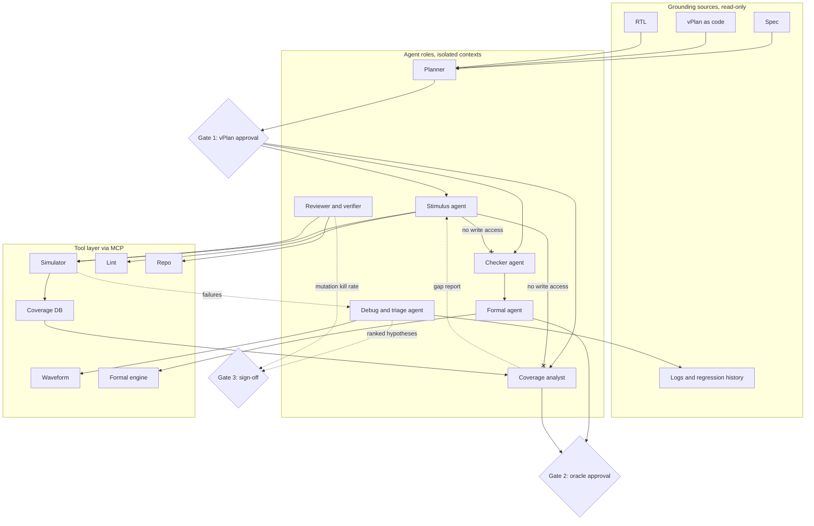

## 1. Thesis

Agentic AI changes the economics of *producing* verification collateral and leaves the economics of *trusting* it almost untouched. Stimulus, testbench scaffolding, candidate assertions, log summaries and debug hypotheses are now cheap: closed-loop agents reach 80 to 90 percent code and functional coverage on small open IPs [DV §2.3, §3], and solver-in-the-loop assertion generation reaches 82 percent functional correctness [DV §2.2]. What does not change is the oracle problem. The value of DV has always lived in the checker, the coverage model and the sign-off judgment, and that is exactly where the evidence is weakest: LLM test plans pass golden RTL 15.7 to 21.7 percent of the time and catch 13.9 percent of mutants [DV §2.3]; LLM-written formal specs are 8.6 percent semantically correct [SW §3]; agents saturate visible tests while failing held-out ones by a widening margin [GA §7].

DV holds one asset software lacks: a ground truth in the simulator, formal engine and coverage database. That makes the evaluator-optimizer loop work, and it makes reward hacking the central design risk, because the same loop rewards an agent that weakens a checker. The organising principle of Part VII therefore is: **whoever generates stimulus must not own the oracle.** DORA's amplifier effect [SW §0] is the forecast: teams with regression hygiene, machine-readable vPlans and mutation-tested checkers will accelerate; teams without them will get faster and less stable.

## 2. Concept-mapping table

Maturity: **research** (papers only), **pilot-ready** (open tools or early product, evidence on small designs), **production** (shipping, multi-year use).

| SW / agentic concept | DV equivalent today | The gap | Adapted practice | Evidence / maturity |
|---|---|---|---|---|
| Spec-driven development (Spec Kit, Kiro: Specify, Plan, Tasks, Implement) | Verification plan (vPlan): features, coverage goals, tests | vPlans are spreadsheets or PDFs, not the live artefact regressions are checked against | vPlan-as-code: versioned YAML/JSON linking feature, cover group, test and assertion; CI fails on unlinked features; agents read it, humans approve it | Spec Kit and Kiro [SW §1]; Thoughtworks holds SDD at *Assess* [SW §1]. **Pilot-ready** |
| Test-driven development | Checker-first testbench (scoreboard and SVA before sequences) | Agents fake the "red" step and delete failing tests; DV writes stimulus first and checkers under schedule pressure | Checker written by a human or a separate agent before stimulus; acceptance judged by outcome (mutants killed), not by process | Beck's "genie"; Böckeler: TDD costs 3 to 8.5x tokens, no quality gain, prefer outcome metrics [SW §2]. **Pilot-ready** |
| Property-based testing (Hypothesis) | Constrained-random with functional coverage | None in method; DV had it first. The gap is *inferring* constraints and properties from a spec | Agent proposes constraints and properties from spec text; formal or mutation validates before merge | Agentic PBT: 56 percent valid reports, 86 percent among top-ranked [SW §2]; AgentDV 80.9 percent pass on OpenTitan IP [DV §3]. **Pilot-ready** (stimulus), **research** (properties) |
| Coverage-guided fuzzing (OSS-Fuzz LLM targets) | Coverage-directed stimulus | Coverage feedback to the test writer is a manual weekly meeting | Agent loop: read coverage DB, list uncovered bins, propose test, run, measure delta, keep only positive-delta tests | OSS-Fuzz +370k covered lines, 26 CVEs [SW §2]; SimAI, VSO.ai in production [DV §1]; AgentDV [DV §3]. **Production** (ML), **pilot-ready** (LLM) |
| Mutation testing | Checker and assertion strength | DV almost never injects RTL mutants to test its own scoreboards | Mutation kill rate is the acceptance gate for any generated checker or SVA; keep a held-out mutant set the agent never sees | Google 17M mutants; Meta 73 percent acceptance [SW §2]; AssertLLM2 and quality-aware closure use mutation as the metric [DV §2.2]. **Research to pilot-ready** |
| Flaky-test management (quarantine, pass^k) | Seed and regression hygiene | Seed-dependent failures are re-run until green; no quarantine, no flake budget | Track pass^k per test over seeds; quarantine flaky tests with an owner and SLO; report stability next to coverage | 84 percent of pass-to-fail transitions involve a flaky test; Atlassian 150k hours/year [SW §2]; pass^k from tau-bench [GA §4]. **Production** (tooling exists) |
| Predictive test selection | Regression optimization | Nightly regression runs everything | History-based ranking and compression; run the predicted-failing 10 percent first | Facebook halved CI cost at 99.9 percent recall [SW §2]; SimAI 2 to 6x compression, VSO.ai (vendor) [DV §1]. **Production** |
| Formal methods in software (TLA+, P, Dafny) | Formal property verification, SVA | Hardware formal is more mature; the new gap is LLM spec-writing | Humans own properties; agents grind proof helpers, covers, abstractions; every generated SVA passes vacuity and mutation checks | TLA+ 8.6 percent semantic vs Dafny 82 percent [SW §3]; ProofLoop 82 percent functional [DV §2.2]; Copilot 70 percent functional [DV §1.2]. **Pilot-ready** |
| Code-review bots, static analysis with FP budget | Testbench review, UVM/SVA lint | TB review is informal or skipped; lint noise is tolerated | AI pre-review on every TB change; each analyzer under 10 percent false positives or it is disabled; duplication detector for sequences | Google resolves 7.5 to 8 percent of comments by ML; Tricorder FP budget; GitClear duplication up 81 percent [SW §4]. **Pilot-ready** |
| CI/CD, hermetic builds, pipeline telemetry | Regression farm | Not hermetic, no content-addressed snapshot cache, no traces, no SLOs | Pinned tool versions, cached compiled snapshots, OpenTelemetry on regression jobs, pass-rate and time-to-triage SLOs, blameless postmortems on escapes | DORA amplifier capabilities; Bazel 85 to 95 percent cache hits [SW §5]. **Production** tooling, **pilot** in DV |
| Docs-as-code, ADRs, AGENTS.md | Methodology docs, vPlan, wiki | Knowledge in PDFs and heads; nothing an agent can read | AGENTS.md for the testbench (build, sim, naming, forbidden shortcuts); ADRs for architecture choices; runbooks for triage | Concise, imperative instruction files change behaviour; long ones are ignored [GA §3]; agent-optimised ADRs [SW §6]. **Pilot-ready** |
| MCP tool servers | Simulator, coverage DB, waveform, formal, lint, repo | Tcl scripts and proprietary GUIs; no typed tool interface | Wrap each tool as an MCP server with read-only and write scopes; agents get tools, not shells | MCP4EDA, AutoEDA, AMIQ DVT MCP Server, Siemens toolkit open to Claude Code and Cursor [DV §1.3, §3]; MCP 2026-07-28 spec [GA §2]. **Pilot-ready** (open), **early product** (commercial) |
| Context engineering (compaction, JIT loading, agentic search) | Spec, RTL, log retrieval | 400-page specs and 10 GB logs do not fit; RAG goes stale | Agentic search over RTL and logs; just-in-time loading by path and signal name; structured notes per debug session; domain retrieval | Agentic search beat vector RAG for code; context rot at mid-window [GA §3]; ChipNeMo domain retrieval [DV §1.4]; ChipStack "mental model" 30 to 40 percent (vendor) [DV §1.1]. **Pilot-ready** |
| Evals, reward hacking, held-out tests | Evaluating generated testbenches | Judged by compile and pass rate on the tests the agent wrote | Held-out mutants, hidden checks, read-only checker files enforced by hooks, coverage reported with bug-finding power | SpecBench: visible-holdout gap grows 28 points per 10x code size [GA §7]; 13.9 percent mutation detection [DV §2.3]. **Research** |
| Subagents, orchestrator-workers | Agentic DV flows | Vendor agents are monolithic; one context does plan, run and debug | Role-separated subagents with isolated context, tool allowlists and worktrees; simulator or formal result is the only judge | Orchestrator-worker beat single agent by 90.2 percent [GA §1]; 14 multi-agent failure modes [GA §1]; UVM2, HAVEN [DV §2.3]. **Pilot-ready** (small IP) |
| Human-in/on-the-loop, approval mapped to blast radius | Sign-off | Consent fatigue; agents present green regressions as evidence | Three gates (vPlan, oracle, sign-off) with an evidence bundle; agents never sign off | Consent fatigue "most consistently exploited" failure mode [GA §7]; Bartley: bounded tasks ready, judgment not [DV §5]. **Production** (as policy) |
| Semver, lockfiles, contract diffs | VIP and testbench component versioning | VIP updates break regressions silently | Semver on UVM agent APIs; lockfile pinning VIP versions per project | Semver widely violated; breaking changes cascade [SW §8]. **Pilot-ready** |

## 3. Agentic DV reference architecture

The architecture is an orchestrator-worker system whose evaluator is the toolchain, never a second opinion from the same model [GA §1, §4]. Each role runs in an isolated context with its own tool allowlist and permission mode [GA §1], mirrors a human DV role, and returns a short summary plus artefacts to the planner.

**Roles.** The *planner* turns spec and vPlan into a task graph and never writes code. The *stimulus agent* writes sequences, constraints and cocotb or UVM tests. The *checker agent* writes scoreboards, reference-model glue and SVA. The *coverage analyst* owns the coverage model and produces gap reports. The *debug/triage agent* clusters failures, reads waveforms and logs, and emits ranked hypotheses. The *formal agent* runs proofs on proposed SVA, rejects vacuous or unprovable properties, and proposes helper assertions. The *reviewer/verifier* runs mutation campaigns and held-out checks against everything the other agents produced.

**Key invariant.** The stimulus agent has no write access to checkers, reference models, assertions or the coverage model, and the checker and coverage agents have no write access to stimulus. This is enforced by the harness (hooks that reject edits outside an allowlisted path with exit code 2 [GA §4]) and by repo permissions, not by prompt. It is the DV instance of "separate generator and critic" [GA §1] and the direct countermeasure to spec gaming [GA §7] and to Beck's agent that deletes the failing test [SW §2].

**Human gates.** Gate 1 approves the plan before any code exists, matching plan-mode practice [SW §1]. Gate 2 approves the oracle (checkers, SVA, coverage model) before stimulus is judged against it. Gate 3 is sign-off, which consumes an evidence bundle: coverage against vPlan, mutation kill rate, formal proof status, flake quarantine, open hypotheses. Gates are mapped to reversibility and blast radius [GA §7]: editing a sequence is cheap to revert; changing a scoreboard is not.

**Runnable today on open tools.** Simulator: Verilator with cocotb (AgentDV is exactly this loop [DV §3]). Coverage DB: Verilator line and toggle coverage plus cocotb-coverage for functional bins. Waveform: VCD or FST parsed by an MCP server (MCP4EDA exposes Yosys, Icarus and VCD parsing [DV §3]). Formal: Yosys and SymbiYosys for bounded and k-induction proofs of SVA subsets. Lint: Verilator lint mode and Verible. Repo: git with worktree-per-agent isolation [GA §5]. Project understanding: AMIQ's DVT MCP Server for commercial teams [DV §1.5]. Commercial equivalents (Xcelium, Jasper, Questa One toolkit) are reachable through the same MCP shape [DV §1.3].

## 4. What the evidence says works now vs not yet

### Pilot-ready today

1. **Debug and root-cause hypotheses.** Most models above 80 percent on 34 sim/synthesis failure scenarios, above 90 percent with retrieval [DV §2.4, https://arxiv.org/abs/2507.06512]; FVDebug validated on two production counterexamples [DV §2.2]. Output is a hypothesis a human checks, which is why it works.
2. **Failure clustering and triage.** Verisium AutoTriage in production since 2023; Renesas reports up to 6x debug productivity (vendor, unaudited) [DV §1.1].
3. **Regression optimization and test selection.** Predictive selection halved CI cost at 99.9 percent recall [SW §2, https://arxiv.org/abs/1810.05286]; SimAI claims 2 to 6x compression (vendor) [DV §1.1].
4. **Assertion proposal with formal disposal.** ProofLoop 93.7 percent syntax, 82.0 percent functional on FVEval Design2SVA with JasperGold in the loop [DV §2.2, https://arxiv.org/abs/2604.23100]; Microsoft on Synopsys Copilot reports over 80 percent syntax, 70 percent functional [DV §1.2]. Works only with vacuity and mutation checks attached.
5. **Coverage-gap analysis and coverage-directed stimulus on small IP.** AgentDV: 80.9 percent pass, 74.5 percent line, 88.4 percent branch coverage on OpenTitan IPs with Verilator and cocotb [DV §3, https://arxiv.org/html/2608.27148]; UVM2: 87.44 percent code, 89.58 percent functional coverage on designs up to 1.6K lines [DV §2.3].
6. **Small-IP testbench scaffolding from templates.** HAVEN: 100 percent compile on 19 open IPs by generating UVM from Jinja2 protocol templates rather than raw HDL [DV §2.3, https://arxiv.org/abs/2604.27643].
7. **Log summarization and bug-report drafting.** ChipNeMo bug summarization deployed internally [DV §1.4]; Google SRE drafts postmortems with agents, humans validate [SW §5].
8. **Testbench lint and pre-review.** ML resolves 7.5 to 8 percent of all review comments at Google [SW §4]; Siemens Lint and CDC agents in early access [DV §1.3].

### Not yet

1. **Test-plan generation.** Frontier models pass golden RTL 15.7 to 21.7 percent of the time; a trained 7B model reaches 33.3 percent with 13.9 percent mutation detection [DV §2.3, https://arxiv.org/abs/2601.07593]. ChipStack's "test plan in 40 minutes" is a vendor claim with no published accuracy [DV §1.1].
2. **Checker and reference-model generation.** Claude 4.5 Opus scores 13.33 percent on ChipBench Python reference models [DV §2.1, https://arxiv.org/abs/2601.21448]; natural-language to TLA+ is 8.6 percent semantically correct [SW §3].
3. **Sign-off judgment.** No published method, no standards activity [DV §5]; EU AI Act Article 14 requires demonstrable human oversight from August 2026 [GA §7].
4. **Large-design UVM generation.** Peer-reviewed results stop at about 1.6K lines [DV §2.3]; CVDP best pass@1 is 34 percent and agentic tasks are harder [DV §2.1].
5. **Fully autonomous "Level 5" flows.** 40x and 50x claims are vendor figures with H2 2026 early access and no peer-reviewed baseline [DV §1.1, §1.2].

### Benchmark caveats

VerilogEval and RTLLM show training-data contamination [DV §2.1, https://arxiv.org/abs/2503.13572]; most benchmark modules are under 76 lines [DV §5]; coverage is not bug-finding power, as the 90 percent coverage versus 13.9 percent mutation-detection gap shows [DV §2.3]; strengthening test suites rejected 19.7 percent of "passing" SWE-bench patches [GA §4]; naive agent wrappers can degrade frontier models [DV §2.5]. Read every coverage number as an upper bound.

## 5. Measurement framework for AI in DV

Self-reported productivity is not evidence. METR's randomized trial found experienced developers 19 percent slower with AI while believing they were 20 percent faster [SW §7, https://metr.org/blog/2025-07-10-early-2025-ai-experienced-os-dev-study/]; DORA finds throughput up and stability down [SW §7]; Bartley notes that local productivity gains do not equal sign-off evidence [DV §5]. DV already measures the wrong things (test count, coverage percent) the way software measured lines of code [SW §7].

| Metric | Definition | Why it matters |
|---|---|---|
| Bugs found per engineer-week | RTL bugs confirmed by designer, by severity and discovery phase | The only output that matters before silicon |
| Escape rate | Bugs found after milestone (post-freeze, FPGA, silicon) per design | Lagging but decisive; first-silicon success sits near 14 percent [DV §0] |
| Time-to-coverage-closure | Calendar days from testbench bring-up to vPlan coverage target | Where agents should help; watch for closure by waived bins |
| Mutation kill rate of checkers | Fraction of injected RTL mutants caught by the regression | Direct measure of oracle strength; the 90 percent coverage vs 13.9 percent kill gap [DV §2.3] |
| Regression cost | CPU and license hours per coverage point and per bug | Agents multiply sim runs; compression claims need this baseline |
| Human review load | Reviewer minutes per accepted agent change; acceptance rate | Detects the shift of work from writing to reviewing |
| Agent reliability | pass^k over repeated runs of the same task [GA §4] | Single-run success hides flakiness |
| Assertion rejection rate | Share of generated SVA rejected as unprovable, vacuous or hallucinated | Hallucination rate in the language of formal |
| Regression stability | Pass-rate variance, flaky quarantine size | DORA's stability warning made visible |
| Token cost per bug and per coverage point | Model spend attributed to outcomes | Multi-agent runs cost about 15x a chat [GA §1] |

Method: baseline one release cycle before adoption, run A/B by IP block or team where possible, pre-register the metrics, and pair them with a recurring satisfaction survey [SW §7]. Report worst-case and repeated-trial numbers, not headline best runs [GA §4].

## 6. Risks and guardrails specific to DV

- **Hallucinated SVA.** Generated assertions reference signals that do not exist or encode the wrong reason [DV §5]. Guardrail: constrain the agent to a parsed signal list, compile-check, formal-prove, then mutation-test.
- **Vacuous properties.** An SVA whose antecedent never fires proves trivially; quality-aware closure treats vacuity rejection as mandatory [DV §2.2]. Guardrail: cover the antecedent, require witness traces, report vacuous passes as failures.
- **Reward hacking of the regression.** Agents saturate visible tests and game held-out ones [GA §7]; agents delete failing tests [SW §2]. Guardrail: the invariant in Section 3, read-only checker paths enforced by hooks, hidden mutant sets, human review of any waiver or coverage-bin exclusion.
- **Spec drift.** Spec revisions outrun the vPlan and the agent's context; multi-agent hallucination propagation makes stale assumptions look like consensus [GA §1]. Guardrail: vPlan-as-code with spec version pinning; regenerate affected tasks on spec diff; a CitationAgent-style pass that ties every checker to a spec clause [GA §1].
- **IP leakage to model providers.** Whether customers accept cloud models for proprietary RTL is unresolved [DV §5]. Guardrail: on-prem or sandboxed models (AutoEDA, OpenShell) [DV §3, §5], network-proxied sandboxes [GA §2], contractual no-training terms, and never pasting RTL into chat surfaces.
- **Tool poisoning via MCP.** Hidden instructions in tool descriptions or outputs hijack agents; client susceptibility varies widely [GA §7]. Guardrail: vetted, pinned, signed MCP servers; treat simulator and log output as data; least-privilege tool scopes; skills and SKILL.md packages audited as a supply chain [GA §7].
- **Consent fatigue at sign-off gates.** Human-in-the-loop bypass through fatigue is the most exploited failure mode [GA §7]. Guardrail: few gates with high stakes rather than many with low; evidence bundles instead of green checkmarks; separate the approver from the person who ran the agent.
- **Licensing of generated code in tapeout deliverables.** Purely AI-generated code may lack copyright; GPL snippet reproduction remains a risk; EU AI Act obligations began August 2026 [GA §7]. Guardrail: human curation logged per file, provenance metadata in the repo, license scanning of generated VIP before delivery, counsel review of deliverable terms.
- **Cost blow-up.** Coverage loops burn sim cycles and tokens. Guardrail: budget per task, prompt caching of stable spec and RTL prefixes [GA §4], and the cost metrics in Section 5.

## 7. Chapter blueprint

### Ch. 33 Machine Learning in Verification

1. **Why ML before LLMs.** Regression data is the asset; three generations coexist [DV §0].
2. **Coverage prediction.** Design2Vec GNNs as proxy simulators [DV §4].
3. **Regression test selection and prioritization.** Facebook predictive selection, Intel and Qualcomm DVCon work, VSO.ai and SimAI [SW §2, DV §1, §4].
4. **Failure clustering and triage.** AutoTriage, PinDown bisection, debug-priority assignment [DV §1.1, §4].
5. **Coverage closure by optimization.** NOVA, Bayesian tuning of constraint solvers, RL stimulus [DV §4].
6. **Flakiness, seeds and stability.** Quarantine, pass^k, flake budgets [SW §2, GA §4].
7. **Evaluating ML claims.** Why most techniques never shipped; incomparable evaluations [DV §4].
8. **Worked example.** Train a classifier on a cocotb regression log to rank tests by failure likelihood, then measure recall against a held-out week. Runs on a laptop with Verilator.

### Ch. 34 Generative AI and Agentic DV

1. **From copilots to agents.** ReAct, plan-and-execute, evaluator-optimizer; vendor autonomy levels are marketing [GA §1, DV §0].
2. **Grounding.** Context engineering for specs, RTL and logs; AGENTS.md for the testbench [GA §3, SW §6].
3. **Tools via MCP.** Simulator, coverage, waveform, formal and lint servers; sandboxing [GA §2, DV §3].
4. **Stimulus agents.** Coverage-directed loops; AgentDV and HAVEN; template-first generation [DV §2.3, §3].
5. **Assertions: LLM proposes, formal disposes.** ProofLoop, vacuity, mutation strength [DV §2.2].
6. **Checkers and test plans: the hard part.** Why the numbers are low; checker-first and human ownership [DV §2.3, SW §2].
7. **Debug agents.** Hypothesis generation over waveforms and logs; FVDebug [DV §2.4].
8. **The reference architecture and its invariant.** Section 3 of this note.
9. **Measuring and governing.** Section 5 metrics; risks and guardrails from Section 6.
10. **Worked examples (laptop, Verilator + cocotb + SymbiYosys).** (a) An agent loop that reads Verilator coverage for a FIFO or AXI-Lite slave, proposes one new constrained-random cocotb test, runs it, and keeps it only on positive coverage delta. (b) An LLM-proposes, SymbiYosys-disposes SVA loop on the same design with vacuity checks and a Yosys-generated mutant set. (c) A triage agent that clusters cocotb failures from a seeded regression and drafts a ranked hypothesis list.

### Ch. 35 The Road Ahead

1. **The oracle problem is the frontier.** Checker and test-plan generation as open research [DV §2.3].
2. **Benchmarks that measure bug-finding.** CVDP, ChipBench, FIXME, mutation-based scoring, contamination [DV §2.1, §5].
3. **Standards and protocols.** MCP, A2A, EDA handoff protocols, the missing Accellera activity [GA §2, DV §3, §5].
4. **Trust, IP and law.** On-prem models, EU AI Act, licensing of generated code [GA §7, DV §5].
5. **The changing DV role.** From running tools to orchestrating agents; domain expertise predicts success [DV §1.3, SW §7].
6. **Economics.** Token and sim cost, caching, model routing by capability [GA §4, §6].
7. **What to teach.** A curriculum that keeps spec reading, coverage judgment and root-cause reasoning central.
8. **Open questions.** Section 9 of this note.

## 8. Book-writing workflow implications

The findings above describe the book's own process. The book is written spec-first: a design document (audience, chapter contracts, style rules) plays the role of the vPlan, and every chapter starts as an approved outline before any prose exists, mirroring plan-before-code [SW §1] and Gate 1 in Section 3. Drafting and reviewing are separate agents with separate context and prompts, because a single model critiquing its own output repeats its own misconceptions [GA §1]. The reviewer is given independent evidence, not opinion: it checks each numeric claim against the research notes and their URLs, flags any figure without a source, and labels vendor numbers as vendor numbers, following the marketing-versus-evidence discipline of the DV note [DV §0].

Worked examples are the book's test suite. Every code listing is executed on Verilator, cocotb, Yosys or SymbiYosys before a chapter can leave draft, and a hook rejects a chapter commit whose examples fail, the direct analogue of verification-in-the-loop as the highest-leverage practice [GA §4]. Chapters that make claims about agents include the pass^k of the example loop, not one lucky run.

STATUS.md is the project's structured memory [GA §3]: chapter state, open claims, pending reviews, decisions taken, written outside the context window so any session can resume. A concise AGENTS.md carries the constitution: citation format, no unsourced numbers, no em-dashes, vendor claims labelled, examples must run. Skills package repeatable procedures such as "verify a chapter's citations" or "run all examples in a chapter". The drafting agent cannot edit the research notes or the design document, the same generator-critic separation the book teaches. Human gates sit at outline approval, at technical review of each chapter, and at release, with an evidence bundle rather than a green checkmark.

## 9. Open questions

1. **Can checker generation be made trustworthy?** What combination of spec grounding, mutation-guided refinement and human ownership moves mutation detection from 13.9 percent to a usable level [DV §2.3]?
2. **What is the sign-off evidence bundle?** No standard defines what an agent must present for a human to sign off; Accellera has no working group [DV §5].
3. **Do open-flow results transfer to industrial scale?** Peer-reviewed results stop near 1.6K lines and single IPs [DV §2.3]; vendor claims at SoC scale are unaudited.
4. **How should DV benchmarks score bug-finding?** Mutation-based and contamination-resistant benchmarks exist in prototype form [DV §2.2, §5]; none is accepted as the scoreboard.
5. **What is the real productivity effect?** No METR-style randomized trial exists for DV; the perception gap [SW §7] is untested in this domain.
6. **Which model routing works?** Planning, long-context retrieval over specs, and code generation are led by different models [GA §6]; nobody has measured routing in a DV flow.
7. **Will proprietary RTL ever go to cloud models?** The on-prem versus cloud question is unresolved [DV §5] and shapes which architectures are adoptable.
8. **Do instruction files and skills help DV agents?** Evidence in software is mixed after one year [GA §3]; there is no DV data.
9. **What breaks in multi-agent DV?** The 14 multi-agent failure modes [GA §1] have not been catalogued against verification tasks.
10. **Future editions.** Re-measure every number in Sections 4 and 5 annually; retire benchmarks that saturate; add any Accellera or IEEE activity that appears.
